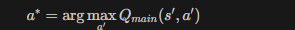

# 🔑 项目核心方法与代码

---

## 1. 神经网络结构 (`dqn_network.py`)

**DQNNetwork** — 卷积神经网络，将游戏帧映射为各动作的 Q 值：

```python
class DQNNetwork(Model):
    def __init__(self, num_actions, agent_history_length):
        self.normalize = Lambda(lambda x: x / 255.0)  # 归一化
        self.conv1 = Conv2D(32, 8, strides=4, activation="relu", 
                           kernel_initializer=VarianceScaling(2.0))
        self.conv2 = Conv2D(64, 4, strides=2, activation="relu", ...)
        self.conv3 = Conv2D(64, 3, strides=1, activation="relu", ...)
        self.flatten = Flatten()
        self.dense1 = Dense(512, activation='relu', ...)
        self.dense2 = Dense(num_actions, activation="linear")  # 输出 Q(s,a)

    @tf.function
    def call(self, x):
        x = self.normalize(x)
        x = self.conv1(x) → self.conv2(x) → self.conv3(x)
        x = self.flatten(x) → self.dense1(x) → self.dense2(x)
        return x  # shape: (batch, num_actions)
```

---

## 2. ε-贪心动作选择 (`get_action`)

```python
@tf.function
def get_action(self, state, exploration_rate):
    if tf.random.uniform(()) < exploration_rate:
        action = tf.random.uniform((), maxval=num_actions, dtype=tf.int32)  # 探索
    else:
        q_value = self.main_network(state)
        action = tf.argmax(q_value, axis=1)  # 利用
    return action
```

---

## 3. DQN 的 Q 网络更新 (`dqn_agent.py`)

**关键**：直接用目标网络的最大 Q 值

```python
@tf.function
def update_main_q_network(self, state_batch, action_batch, reward_batch, 
                          next_state_batch, terminal_batch):
    with tf.GradientTape() as tape:
        # DQN: 用 target network 的 max Q
        q_target = self.target_network(next_state_batch)
        max_q_target = tf.reduce_max(q_target, axis=1)  # ★ DQN 核心
        
        expected_q = reward + γ * max_q_target * (1 - done)
        main_q = self.main_network(state_batch)[action]
        loss = Huber(expected_q, main_q)
    
    gradients = tape.gradient(loss, self.main_network.trainable_variables)
    self.optimizer.apply_gradients(...)
```

---

## 4. DDQN 的 Q 网络更新 (`ddqn_agent.py`)

**关键**：用主网络选动作，用目标网络评估 Q 值（解耦）

```python
@tf.function
def update_main_q_network(self, state_batch, action_batch, reward_batch,
                          next_state_batch, terminal_batch):
    with tf.GradientTape() as tape:
        # DDQN: 主网络选动作，目标网络评估
        q_online = self.main_network(next_state_batch)
        action_q_online = tf.argmax(q_online, axis=1)  # ★ 主网络选动作
        
        q_target = self.target_network(next_state_batch)
        ddqn_q = q_target[action_q_online]  # ★ 目标网络评估该动作
        
        expected_q = reward + γ * ddqn_q * (1 - done)
        main_q = self.main_network(state_batch)[action]
        loss = Huber(expected_q, main_q)
    
    gradients = tape.gradient(loss, self.main_network.trainable_variables)
    self.optimizer.apply_gradients(...)
```

---

## 5. 目标网络同步 (`update_target_network`)

```python
@tf.function
def update_target_network(self):
    for main_var, target_var in zip(
        self.main_network.trainable_variables,
        self.target_network.trainable_variables
    ):
        target_var.assign(main_var)  # 硬更新
```

---

## 6. 经验回放 (`memory.py`)

```python
Transition = namedtuple("Transition", ("state", "action", "reward", "next_state", "terminal"))

class ReplayMemory:
    def __init__(self, capacity=10000, minibatch_size=32):
        self._memory = []
        self._index = 0
    
    def push(self, state, action, reward, next_state, terminal):
        """循环覆盖存储经验"""
        trsn = Transition(state, action, reward, next_state, terminal)
        self._memory[self._index] = trsn
        self._index = (self._index + 1) % self.capacity
    
    def get_minibatch_indices(self):
        """随机采样索引（避免跨 episode 边界）"""
        indices = np.random.randint(history_len, len(self), size=batch_size)
        return indices
    
    def generate_minibatch_samples(self, indices):
        """根据索引生成训练批次"""
        return state_batch, action_batch, reward_batch, next_state_batch, terminal_batch
```

---

## 7. ε 衰减策略 (`get_eps`)

```python
@tf.function
def get_eps(self, current_step):
    # 线性衰减: 1.0 → 0.1 (前 100 万步)
    if current_step < replay_start_size:
        eps = 1.0
    elif current_step < final_explr_frame:
        eps = 1.0 - 0.9 * (current_step - replay_start_size) / (final_explr_frame - replay_start_size)
    else:
        eps = 0.1 → 0.01 (继续衰减)
    return eps
```

---

## 8. 训练主循环 (`train`)

```python
def train(self):
    while total_step < training_frames:
        state = env.reset()
        while not done:
            # 1. 选动作
            action = get_action(state, get_eps(total_step))
            
            # 2. 执行动作
            next_state, reward, done, info = env.step(action)
            
            # 3. 存经验
            memory.push(state, action, reward, next_state, done)
            
            # 4. 每 4 步更新主网络
            if total_step % 4 == 0 and total_step > replay_start_size:
                batch = memory.sample()
                update_main_q_network(batch)
            
            # 5. 每 1000 步同步目标网络
            if total_step % 1000 == 0:
                update_target_network()
            
            state = next_state
```

---

## 📊 DQN vs DDQN 核心差异对比

| 算法 | TD 目标计算 | 代码关键行 |
|------|-------------|-----------|
| **DQN** | $r + \gamma \max_{a'} Q_{target}(s', a')$ | `tf.reduce_max(q_target, axis=1)` |
| **DDQN** | $r + \gamma Q_{target}(s', \arg\max_{a'} Q_{main}(s', a'))$ | `tf.argmax(q_online)` + `q_target[action]` |

---

以上就是本项目最重要的方法实现和代码片段，涵盖了网络架构、动作选择、Q 值更新（DQN/DDQN）、经验回放和训练流程的核心逻辑。
